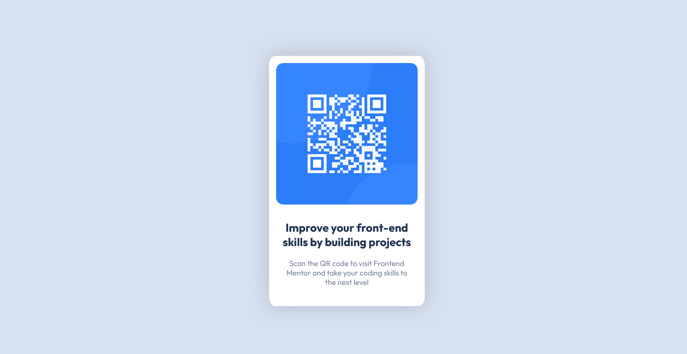

# Frontend Mentor - QR code component solution

This is a solution to the [QR code component challenge on Frontend Mentor](https://www.frontendmentor.io/challenges/qr-code-component-iux_sIO_H). Frontend Mentor challenges help you improve your coding skills by building realistic projects. 

## Table of contents

- [Overview](#overview)
  - [Screenshot](#screenshot)
  - [Links](#links)
- [My process](#my-process)
  - [Built with](#built-with)
  - [What I learned](#what-i-learned)
  - [Useful resources](#useful-resources)
- [Author](#author)
- [Acknowledgments](#acknowledgments)

## Overview

### Screenshot




### Links

- Solution URL: [GitHub URL](https://github.com/AnnMEldo31/qr-code-component-main.git)
- [Live Site URL](https://annmeldo31.github.io/qr-code-component-main/)

## My process

### Built with

- Semantic HTML5 markup
- CSS custom properties
- Flexbox
- Mobile-first workflow

### What I learned

I learned how to use flexbox to vertically and horizontally center a div.

 
```css
.container {
  height: 100vh;
  display: flex;
  align-items: center;
  justify-content: center;
}

/* .card is the child div of .container and which needed to be vertically and horizontally centered */
```


### Useful resources

- [A Complete Guide to Flexbox by Chris Coyier](https://css-tricks.com/snippets/css/a-guide-to-flexbox/) - This is an amazing article which helped me understand flexbox. I'd recommend it to anyone still learning this concept.


## Author
- Ann Mary Eldo
- Frontend Mentor - [@AnnMEldo31](https://www.frontendmentor.io/profile/AnnMEldo31)
- Twitter - [@ann_eldo](https://twitter.com/ann_eldo)


## Acknowledgments

Thanks to Dr. Angela Yu for her comprehensive Udemy Course [The Complete 2022 Web Development Bootcamp](https://www.udemy.com/course/the-complete-web-development-bootcamp/) which helped me freshen up my HTML and CSS skills and taught me a few bits of info i didn't before (I used to be confused about relatve and absolute positioning in CSS, but her explanation cleared it up!)
